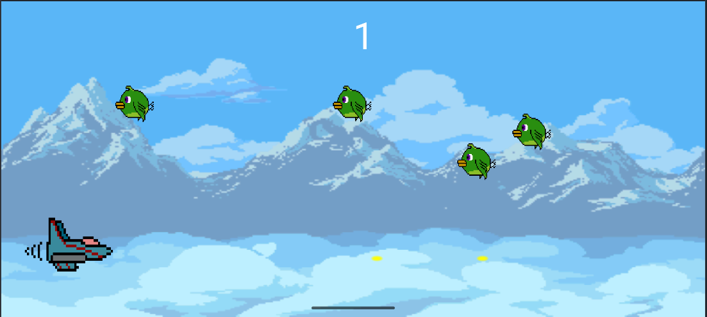

# Juego de Avion - Android (Java)

## Descripción

Este es un juego desarrollado en Android utilizando Java, donde el jugador controla un avión y debe evitar chocar con pájaros mientras los derriba para sumar puntos.

## Mecánica del Juego

El avión asciende o desciende según las pulsaciones en la parte izquierda de la pantalla.

La parte derecha de la pantalla permite disparar para derribar a los pájaros.

Los pájaros aparecen aleatoriamente en la pantalla.

Si el avión choca con un pájaro, el juego termina y el avión es destruido.

Cada pájaro derribado otorga 1 punto al jugador.

## Tecnologías utilizadas

**Lenguaje**: Java

**Plataforma**: Android

**Herramientas**: Android Studio

## Instalación y Ejecución

Clona este repositorio en tu máquina local:

git clone https://github.com/JuanCarlos92/AndroidJuego2D.git

Abre el proyecto en **Android Studio.**

Compila y ejecuta en un dispositivo físico o emulador.

## Capturas de Pantalla

## Mejoras Futuras

Implementar niveles de dificultad.

Agregar diferentes tipos de enemigos.

Incluir power-ups o mejoras para el avión.

Guardado de puntuaciones.
